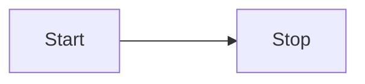
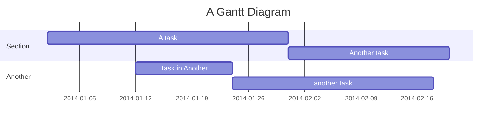

## Built-ins

### Hotkeys

| Command       | Description                                |
| :------------ | :----------------------------------------- |
| ⌘-D COMMAND-D | Insert A Template                          |
| ⌘-E COMMAND-E | Toggle in and out of edit and preview mode |
| ⌘-N COMMAND-N | New Note                                   |
| ⌘-P COMMAND-P | Open the Command palette.                  |

### [Callouts](https://help.obsidian.md/How+to/Use+callouts)

Admonitions / Callout Blocks / Quotes Blocks are now built into Obsidian as of version v0.14.0. The Admonitions plugin is no longer required. Here are a few examples.

> Normal Quote

> [!TIP]
> Tip

> [!QUOTE]
> Very Famous Quote

> [!INFO]
> Information

> [!EXAMPLE]
> Example

### Change Display Text of Internal Links with Pipe (|)

Double brackets are use to create an internal link: `[[New Link]]`. Sometimes you want to have text reference a specific link but not disrupt the flow of the current wording. This is done using the pipe (|) in the internal link like: [[New Link|this text references my new link]]. My pneumonic is **Reference My Text** meaning put in the reference first, followed by the pipe (|) character, followed by the text as you want it to read.

```
[[New Link]]
[[New Link|this is the text that will be shown]]
```
### GitHub Relative Links
[This is the text that will appear](MyNewLink.md)

### Mathematics Examples

$[ x^n + y^n = z^n ]$

$Quote + This + is + a + test$

## Plugins

## Obsidian Plugins

### [Advanced Tables](https://github.com/tgrosinger/advanced-tables-obsidian)

This plugin allows for creating Markdown tables in an easier functions. Generating and updating Markdown tables by hand is a cumbersome. This plugin allows for maintaining tables and automatically formatting them. The Hotkeys table above was created with this plugin.

# [Banners](https://github.com/noatpad/obsidian-banners)

The Banners plugin is used to make the Home landing page with an image at the top of the page.

The banner information is put into the yaml front matter.

```
---
cssclass: dashboard
banner: "![[home-1.jpg]]"
banner_x: 0.5
banner_y: 0.8
---
<div class="title" style="color:Sienna">HOME</div>
```

# [Dataview](https://github.com/blacksmithgu/obsidian-dataview)

And a query language to the Obsidian Vault so it can be queried like a database. Here are a few examples.

- 🔖 Tagged: favorite
  `$=dv.list(dv.pages('#favorite').sort(f=>f.file.name,"desc").limit(4).file.link)`
- 〽️ Vault File Stats
  - File Count: `$=dv.pages().length`
  - Personal recipes: `$=dv.pages('"Family/Recipes"').length`
- 🗄️ Recent file updates
  `$=dv.list(dv.pages('').sort(f=>f.file.mtime.ts,"desc").limit(2).file.link)`
- 🗄️ Oldest file updates
  `$=dv.list(dv.pages('').sort(f=>f.file.mtime.ts,"asc").limit(2).file.link)`
- 🗄️ Files with links to uncreated files.

```dataview
TABLE out AS "Uncreated files" FLATTEN file.outlinks as out WHERE !(out.file) AND !contains(meta(out).path, ".") SORT file.name ASC LIMIT 2
```

```python
print(f"Hello, World!")
```

# Emoji Toolbar

Opened the command palette and type Emoji and use the picker.
`⌘-P COMMAND-P Emoji`
🤯🤪

# Obsidian Git

Performs a backup to git.

# Homepage - Opens a Predefined Homepage

Defaults to Home.

# [URL into Selection](https://github.com/denolehov/obsidian-url-into-selection)

This is a really, really useful plugin.

Insert links (URLs) into a selected text "notion-style" using regular `Ctrl/Cmd + V`. This is a very handy plugin for making references to links. Select the text to be used as the link. Copy the link, come back to Obsidian and do a normal paste and it will fill in the link syntax like the header. You can paste the text to be used as the link, then highlight it, then paste the link onto it or the other way around past the link and then past the link text. The plugin can tell the difference between test and and url and do the right thing.

### Obsidian Core Template

Open the Template settings and put in the path for the template folder. I used Templates. To call up a template `⌘-D` and choose the template.

| Command       | Description       |
| :------------ | :---------------- |
| ⌘-D COMMAND-D | Insert A Template |

### [Periodic Notes](https://github.com/liamcain/obsidian-periodic-notes)

### Periodic Notes

Adds a calendar icon to the tool bar.

- Settings
  - Choose the `Daily Note Template`
  - Chose the `Note Folder` as the destination for the new note.

Mermaid Plugins Test





## References

- [Obsidian Dashboard](https://thesweetsetup.com/creating-obsidian-dashboard/)
- [Obsidian Collaboration With VS Code](https://www.youtube.com/watch?v=d80xGBR3ydE)
- [Obsidian Cheat Sheet and Shortcut Keys](https://github.com/ieshreya/Obsidian-Cheat-Sheet)
- [Nick Milo Linking Your Thinking](https://www.linkingyourthinking.com/)
- [Obsidian and Zotero](https://www.marianamontes.me/post/obsidian-and-zotero/)
- [Dataview: Querying for uncreated files](https://forum.obsidian.md/t/dataview-querying-for-uncreated-files/41848)
- [Dataview join tables and limit output of ungenerated notes](https://forum.obsidian.md/t/dataview-join-tables-and-limit-output-of-ungenerated-notes/50049)
- [Dataview Structure of a Query](https://blacksmithgu.github.io/obsidian-dataview/queries/structure/)
- [Changing the colour of uncreated notes in graph view](https://www.reddit.com/r/ObsidianMD/comments/p0w0ib/changing_the_colour_of_uncreated_notes_in_graph/)
- [GitHub Basic writing and formatting syntax](https://docs.github.com/en/get-started/writing-on-github/getting-started-with-writing-and-formatting-on-github/basic-writing-and-formatting-syntax)
